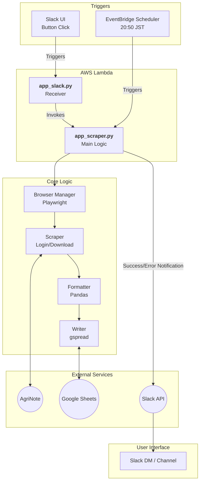

# agrinote-scraper-for-lambda

アグリノートから作業記録エクセルをダウンロードし、GoogleSpreadSheetとして保存する
（保存後Slack通知する処理については別途GASで実装）

## 処理の流れ

本システムは以下のステップでデータを処理します。
TDDを考慮して、各工程は疎結合に設計。

1. **トリガー1（スラックから）**: Slackからボタン押下によりscraper用Lambdaに連携、Slackにレスポンスを返す
1. **トリガー2（定時実行）**: EventBridgeにより毎日20時50分にscraper用Lambdaを起動
1. **Scrape**: `Playwright` を使用してアグリノートから生データを取得
1. **Format**: 取得データを`Pandas` で整形し、スプレッドシート用の行列形式に変換
1. **Load**: `gspread` を介してGoogleSheetsAPIで書き込み



## フォルダ構成

```text
.
|-- src/
|   |-- app_slack.py    # Slackからのリクエストをscraperに繋ぐ（event, contextを渡す）
|   |-- app_scraper.py  # Lambdaエントリポイント（event, contextを受け取る）
|   |-- core/           # 主要ロジック（Writer, Scraper, Formatter, Browser管理）
|   |-- utils/          # 共通処理（Logger, Config）
|-- tests/              # pytestによるテストコード
|-- docker/             # Lambda環境用Dockerfile
|-- README.md
```

## 開発フロー（TDD）

本プロジェクトはテスト駆動開発を採用しています。coreプログラムの新機能の実装やロジックの修正時は、以下の順序で進めます。

1. tests/ 内に期待する挙動のテストを書く（失敗を確認）。
1. src/ 内に最小限の実装を行う。
1. テストをパスさせ、必要に応じてリファクタリングする。

### テスト実行

```bash
uv run pytest
```

### テストの境界線

- **TDD対象（`src/core`と`src/app_...`の一部）**:
  - データのパース、フォーマット変換、バリデーション、Playwrightによるブラウザ操作
  - 外部依存（API/Browser）を排除し、純粋なロジックとして100％テストを実施
- **実機検証対象（`src/app_...`）**:
  - Slack APIとの接続、Lambdaハンドラー
  - モック化のコストが高いため、デプロイ後の疎通確認を優先

## デプロイ手順

本システムはDockerコンテナとしてAWS Lambdaにデプロイします。

1. **イメージのビルドとPush**:
   `./build.sh` を実行、Amazon ECRへイメージをプッシュ
1. **Lambdaの更新**:
   AWSコンソールまたはCLIからプッシュしたイメージをLambdaに適用

※ Playwrightの実行バイナリが含まれるため、イメージサイズが大きくなります。初回起動時は「タイムアウト（初期値3秒）」を1分程度に設定してください。

## 運用・監視

### ログの確認手順

AWS CloudWatch Logsからログを確認

- **Request ID**: 各実行ごとに一意のIDが付与されます。特定の実行を追跡する際はRequest IDでフィルタリングしてください。
- **ログレベル**: `LOG_LEVEL` 詳細なデバッグが必要な場合は`DEBUG`に設定してください。

### エラー通知

スクレイピング失敗時やJSONパース失敗時には、AgriNoteSyncアプリDMまたは`ADMIN_CHANNEL_ID`に指定されたSlackチャンネルへエラー詳細が通知されます。

## 環境変数

実行には以下の環境変数が必要です。

- AGRI_NOTE_ID: アグリノートログインID
- AGRI_NOTE_PASS: アグリノートパスワード
- SPREADSHEET_ID: 出力先スプレッドシートID
- SERVICE_ACCOUNT_JSON: GoogleサービスアカウントのJSON文字列
- SIGNING_SECRET: SlackアプリのSecret
- BOT_TOKEN: SlackアプリのBotToken
- ADMIN_CHANNEL_ID: Slack通知先チャネルID
